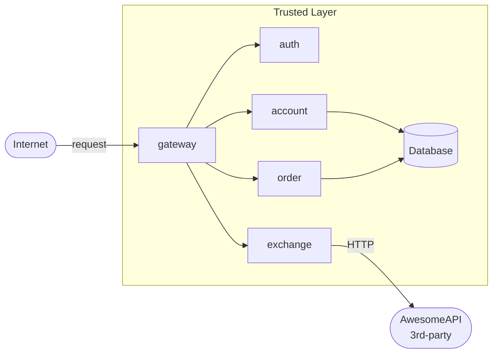
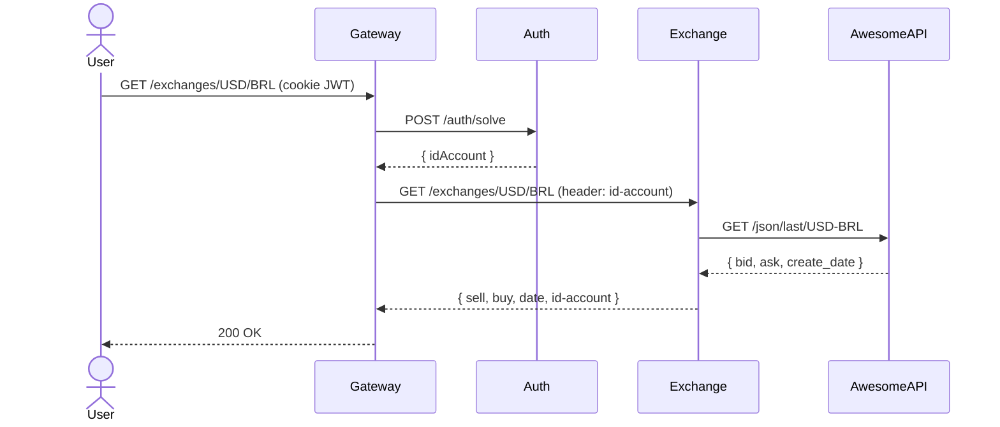

# Exchange API

**Aluno:** Alex Chequer  
**Grupo:** Alex Chequer, Carlos, Lucas  
**Disciplina:** Plataformas, Microserviços, DevOps e APIs — Insper 2026.1  
**Instrutor:** Humberto Sandmann

---

## Sobre o projeto

O projeto é uma aplicação web que permite aos usuários comprar e vender produtos em diferentes moedas. Cada membro do grupo implementa ao menos um microserviço. Este repositório contém a **Exchange API**, responsável por gerenciar as taxas de câmbio entre diferentes moedas, permitindo que os usuários realizem transações em diferentes moedas.

## Entregas

| Atividade | Status | Repositório |
|-----------|--------|-------------|
| Exchange API | ✅ Concluído | [AlexChequer/exchange](https://github.com/AlexChequer/exchange) |
| Bottleneck 1 — Caching | ✅ Documentado | [Bottlenecks](bottlenecks.md) |
| Bottleneck 2 — Observabilidade | ✅ Documentado | [Bottlenecks](bottlenecks.md) |
| Bottlenecks (medidos) | ✅ 91× speedup com Redis cache | [Bottlenecks](bottlenecks.md) |

## Repositórios

| Serviço | Repositório |
|---------|-------------|
| Exchange API (este) | [Microservice-Alex-Carlos-Lucas/exchange](https://github.com/Microservice-Alex-Carlos-Lucas/exchange) |
| Plataforma (raiz) | [Microservice-Alex-Carlos-Lucas/microservices](https://github.com/Microservice-Alex-Carlos-Lucas/microservices) |
| Product API | [Microservice-Alex-Carlos-Lucas/product-service](https://github.com/Microservice-Alex-Carlos-Lucas/product-service) |
| Order API | [Microservice-Alex-Carlos-Lucas/order-service](https://github.com/Microservice-Alex-Carlos-Lucas/order-service) |

## Arquitetura geral

## Diagrama de sequência — Exchange API

